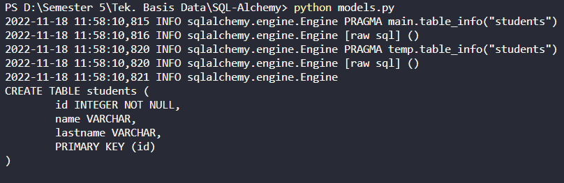
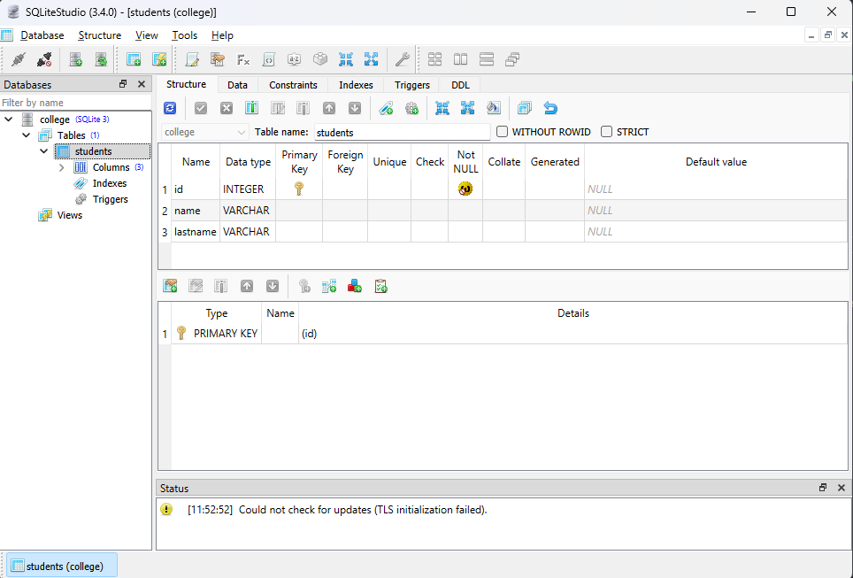

### Membuat Tabel
SQL menyusun ekspresinya terhadap kolom tabel. Objek SQLAlchemy Column mewakili kolom dalam tabel database yang pada gilirannya diwakili oleh Tableobject. Metadata berisi definisi tabel dan objek terkait seperti indeks, tampilan, triggers, dll.

Karena objek kelas MetaData dari SQLAlchemy Metadata adalah kumpulan objek Tabel dan konstruksi skema yang terkait. Ini menampung kumpulan objek Tabel serta pengikatan opsional ke Mesin atau Koneksi.

```python
from sqlalchemy import MetaData
meta = MetaData()
```

Konstruktor kelas MetaData dapat memiliki parameter bind dan skema yang secara default adalah None.

Selanjutnya, kita mendefinisikan tabel kita semua di dalam katalog metadata di atas, menggunakan Table construct , yang menyerupai pernyataan SQL CREATE TABLE biasa.

Objek kelas Tabel mewakili tabel yang sesuai dalam database. Konstruktor mengambil parameter berikut

| Nama | Nama tabel |
| --- | --- |
| metadata | Objek MetaData yang akan mengandung tabel ini |
| Kolom | Satu atau lebih objek kelas kolom |

Objek kolom mewakili kolom dalam tabel database. Konstruktor mengambil nama, tipe, dan parameter lain seperti primary_key, autoincrement, dan batasan lainnya.

SQLAlchemy mencocokkan data Python dengan tipe data kolom generik terbaik yang ditentukan di dalamnya. Beberapa tipe data umum adalah:

- BigInteger
- Boolean
- Date
- DateTime
- Float
- Integer
- Numeric
- SmallInteger
- Sting
- Text
- Time

Untuk membuat tabel siswa di database perguruan tinggi, gunakan potongan berikut:

```python
from sqlalchemy import Table, Column, Integer, String, MetaData
meta = MetaData()

students = Table(
   'students', meta, 
   Column('id', Integer, primary_key = True), 
   Column('name', String), 
   Column('lastname', String), 
)
```

Fungsi create_all() menggunakan objek mesin untuk membuat semua objek tabel yang ditentukan dan menyimpan informasi dalam metadata.

```python
meta.create_all(engine)
```

Kode lengkap diberikan di bawah ini yang akan membuat database SQLite college.db dengan tabel siswa di dalamnya.

")

Karena echo atribut dari fungsi create_engine() disetel ke True, konsol akan menampilkan kueri SQL aktual untuk pembuatan tabel sebagai berikut:



college.db akan dibuat di direktori kerja saat ini. Untuk memeriksa apakah tabel siswa sudah dibuat, Anda dapat membuka database menggunakan alat GUI SQLite seperti SQLiteStudio

