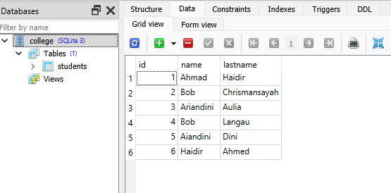

### Menggunakan Delete

Di bab sebelumnya, kita telah memahami apa yang dilakukan ekspresi Pembaruan . Ekspresi selanjutnya yang akan kita pelajari adalah Delete.

Operasi hapus dapat dicapai dengan menjalankan metode delete() pada objek tabel target seperti yang diberikan dalam pernyataan berikut

```python
stmt = students.delete()
```

Dalam kasus tabel siswa, baris kode di atas membuat ekspresi SQL sebagai berikut

```sql
'DELETE FROM students'
```

Namun, ini akan menghapus semua baris dalam tabel siswa. Biasanya kueri DELETE dikaitkan dengan ekspresi logis yang ditentukan oleh klausa WHERE. Pernyataan berikut menunjukkan di mana parameter

```python
stmt = students.delete().where(students.c.id > 2)
```

Ekspresi SQL yang dihasilkan akan memiliki parameter terikat yang akan diganti saat runtime saat pernyataan dijalankan.

```sql
'DELETE FROM students WHERE students.id > :id_1'
```

Contoh kode berikut akan menghapus baris-baris dari tabel siswa yang memiliki nama belakang sebagai 'Lagi'

```python
from sqlalchemy.sql.expression import update
from sqlalchemy import create_engine, MetaData, Table, Column, Integer, String
engine = create_engine('sqlite:///college.db', echo = True)

meta = MetaData()

students = Table(
   'students', meta, 
   Column('id', Integer, primary_key = True), 
   Column('name', String), 
   Column('lastname', String), 
)

conn = engine.connect()
stmt = students.delete().where(students.c.lastname == 'Khanna')
conn.execute(stmt)
s = students.select()
conn.execute(s).fetchall()
```
Hasilnya

```text
(1, 'Ahmad', 'Haidir')
(2, 'Bob', 'Chrismansayah')
(3, 'Ariandini', 'Aulia')
(4, 'Bob', 'Langau')
(5, 'Aiandini', 'Dini')
(6, 'Haidir', 'Ahmed')
```


