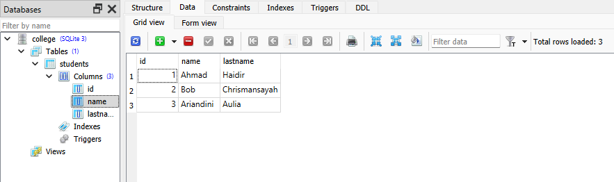
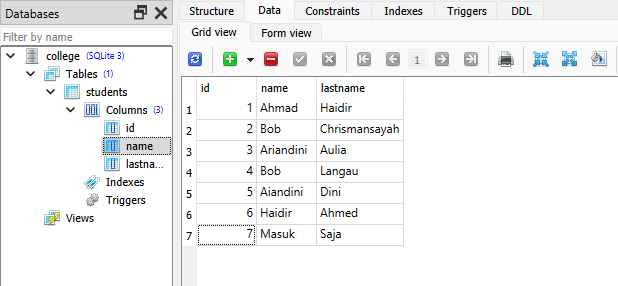

### Mengeksekusi 

Untuk mengeksekusi ekspresi SQL yang dihasilkan, kita harus mendapatkan objek koneksi yang mewakili sumber daya koneksi DBAPI yang diperiksa secara aktif dan kemudian memberi makan objek ekspresi seperti yang ditunjukkan pada kode di bawah ini.

```python
conn = engine.connect()
```
Objek insert() berikut dapat digunakan untuk metode execution()

```python
ins = students.insert().values(name = 'Bob', lastname = 'Chrismansyah')
result = conn.execute(ins)
```

Konsol menunjukkan hasil eksekusi ekspresi SQL seperti di bawah ini

```python
INSERT INTO students (name, lastname) VALUES (?, ?)
('Bob', 'Chrismansyah')
COMMIT
```


Berikut ini adalah keseluruhan cuplikan yang menunjukkan eksekusi query INSERT menggunakan teknik inti SQLAlchemy

```python
from sqlalchemy import create_engine, MetaData, Table, Column, Integer, String
engine = create_engine('sqlite:///college.db', echo = True)
meta = MetaData()

students = Table(
   'students', meta, 
   Column('id', Integer, primary_key = True), 
   Column('name', String), 
   Column('lastname', String),
)
ins = students.insert()
# ins = students.insert().values(name = 'Bob', lastname = 'Chrismansayah')
ins = students.insert().values(name = 'Ariandini', lastname = 'Aulia')
# ins = students.insert().values(name = 'Haidir', lastname = 'Haidir')
# insert data dieksekusi hanya satu per satu, tidak bisa 3 sekaligus
result = conn.execute(ins)
```


Hasilnya dapat diverifikasi dengan membuka database menggunakan SQLite Studio seperti yang ditunjukkan pada tangkapan layar di bawah ini



Variabel hasil dikenal sebagai objek [ResultProxy]([linkurl](https://docs.sqlalchemy.org/en/20/core/connections.html#sqlalchemy.engine.ResultProxy)). Ini analog dengan objek kursor DBAPI. Kami dapat memperoleh informasi tentang nilai kunci utama yang dihasilkan dari pernyataan kami menggunakan ResultProxy.inserted_primary_key seperti yang ditunjukkan di bawah ini

```python
result.inserted_primary_key
[1]
```

Untuk mengeluarkan banyak sisipan menggunakan metode execution many() DBAPI, kita dapat mengirimkan daftar kamus yang masing-masing berisi kumpulan parameter yang berbeda untuk disisipkan.

```python
conn.execute(students.insert(), [
   {'name':'Bob', 'lastname' : 'Langau'},
   {'name':'Aiandini','lastname' : 'Dini'},
   {'name':'Haidir','lastname' : 'Ahmed'},
   {'name':'Masuk','lastname' : 'Saja'},
])
```


