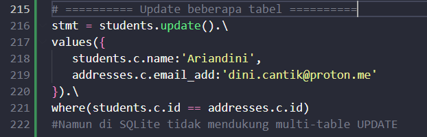

#### Update Beberapa Tabel

Pada bab sebelumnya, kita telah membahas tentang cara menggunakan banyak tabel. Jadi kami melangkah lebih jauh dan mempelajari beberapa pembaruan tabel di bab ini.

Menggunakan objek tabel SQLAlchemy, lebih dari satu tabel dapat ditentukan dalam klausa WHERE dari metode update(). PostgreSQL dan Microsoft SQL Server mendukung pernyataan UPDATE yang merujuk ke beberapa tabel. Ini mengimplementasikan sintaks "UPDATE FROM" , yang memperbarui satu tabel pada satu waktu. Namun, tabel tambahan dapat direferensikan dalam klausa "DARI" tambahan di klausa WHERE secara langsung. Baris kode berikut menjelaskan konsep pembaruan beberapa tabel dengan jelas.

```python
stmt = students.update().\
values({
   students.c.name:'xyz',
   addresses.c.email_add:'abc@xyz.com'
}).\
where(students.c.id == addresses.c.id)
```

Objek pembaruan setara dengan permintaan UPDATE berikut

```sql
UPDATE students 
SET email_add = :addresses_email_add, name = :name 
FROM addresses 
WHERE students.id = addresses.id
```

Sejauh menyangkut dialek MySQL, banyak tabel dapat disematkan ke dalam satu pernyataan UPDATE yang dipisahkan oleh koma seperti yang diberikan di bawah ini

```python
stmt = students.update().\
   values(name = 'xyz').\
   where(students.c.id == addresses.c.id)
```

Kode berikut menggambarkan kueri UPDATE yang dihasilkan 

```sql
'UPDATE students SET name = :name 
FROM addresses 
WHERE students.id = addresses.id'
```

Namun dialek SQLite tidak mendukung kriteria multi-tabel dalam UPDATE dan menunjukkan kesalahan berikut



```sql
NotImplementedError: This backend does not support multiple-table criteria within UPDATE
```