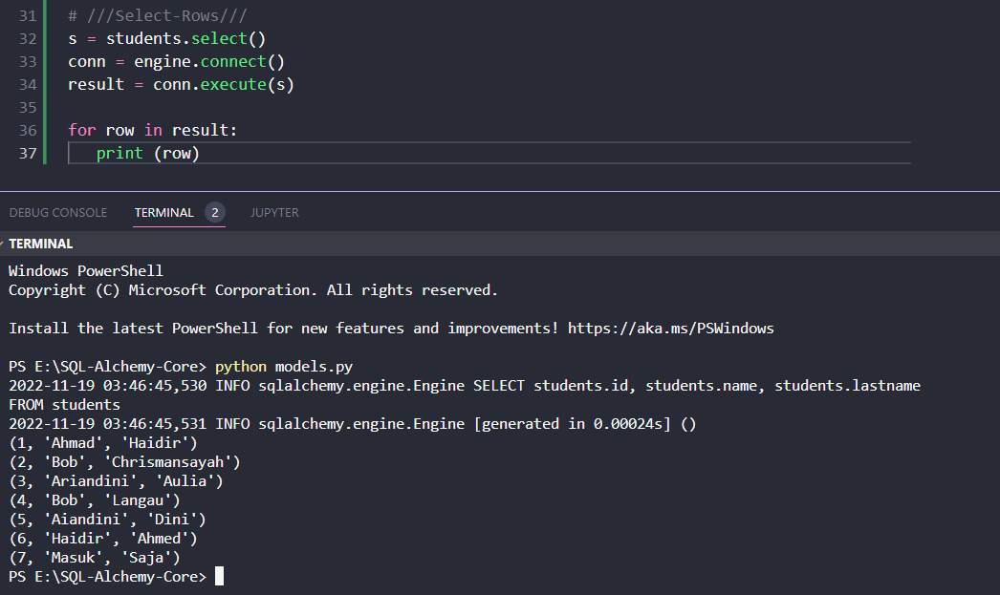
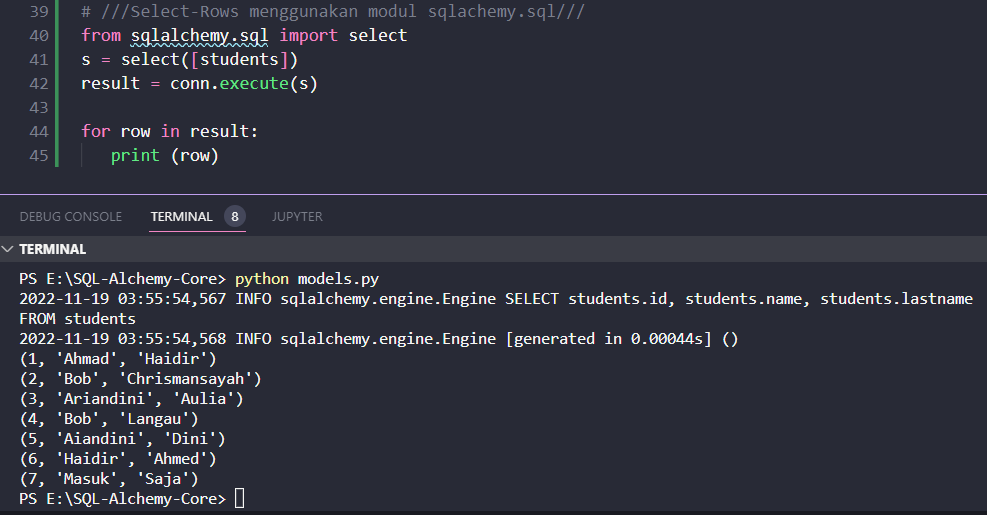

### Memilih Baris

Metode select() dari objek tabel memungkinkan kita membuat ekspresi **SELECT**

```python
s = students.select()
```

Objek _select_ diterjemahkan ke kueri SELECT dengan fungsi str(s) seperti yang ditunjukkan di bawah ini

```python
'SELECT students.id, students.name, students.lastname FROM students'
```

Kita dapat menggunakan objek pilih ini sebagai parameter untuk mengeksekusi () metode objek koneksi seperti yang ditunjukkan pada kode di bawah ini

```python
result = conn.execute(s)
```

Ketika pernyataan di atas dijalankan, shell Python bergema mengikuti ekspresi SQL yang setara

```python
SELECT students.id, students.name, students.lastname
FROM students
```

Variabel yang dihasilkan setara dengan kursor di DBAPI. Kita sekarang dapat mengambil rekaman menggunakan metode fetchone() .

```python
row = result.fetchone()
```

Semua baris yang dipilih dalam tabel dapat dicetak oleh for loop seperti yang diberikan di bawah ini

```python
for row in result:
    print(row)
```

Kode lengkap untuk mencetak semua baris dari tabel siswa ditunjukkan di bawah in

```python
from sqlalchemy import create_engine, MetaData, Table, Column, Integer, String
engine = create_engine('sqlite:///college.db', echo = True)
meta = MetaData()

students = Table(
   'students', meta, 
   Column('id', Integer, primary_key = True), 
   Column('name', String), 
   Column('lastname', String), 
)

s = students.select()
conn = engine.connect()
result = conn.execute(s)

for row in result:
   print (row)
```

Di sini **atribut c adalah alias untuk column**. Output berikut akan ditampilkan di shell

```text
(1, 'Ahmad', 'Haidir')
(2, 'Bob', 'Chrismansayah')
(3, 'Ariandini', 'Aulia')
(4, 'Bob', 'Langau')
(5, 'Aiandini', 'Dini')
(6, 'Haidir', 'Ahmed')
(7, 'Masuk', 'Saja')
```

#### Hasil run sebagai berikut



Di sini, kita harus mencatat bahwa objek pilih juga dapat diperoleh dengan fungsi select() dalam modul sqlalchemy.sql. Fungsi select() memerlukan objek tabel sebagai argumen.

```python
from sqlalchemy.sql import select
s = select([users])
result = conn.execute(s)

# perulangan untuk mencetak select
# for row in result:
#    print (row)
```

Hasilnya akan sama seperti di atas.
 
