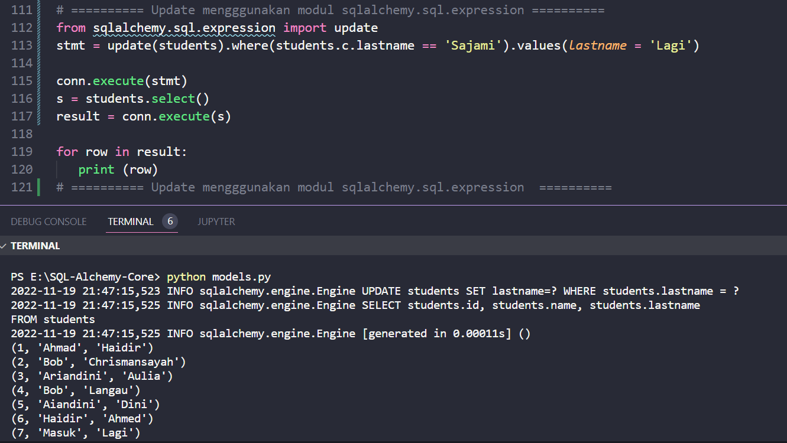

#### Menggunakan UPDATE Expression

Metode **update()** pada objek tabel target membuat ekspresi SQL UPDATE yang setara.

```python
table.update().where(conditions).values(SET expressions)
```

Metode **values()** pada objek update yang dihasilkan digunakan untuk menentukan kondisi SET dari UPDATE. Jika dibiarkan sebagai Tidak Ada, kondisi SET ditentukan dari parameter yang diteruskan ke pernyataan selama eksekusi dan/atau kompilasi pernyataan.

Klausa _where()_ adalah ekspresi Opsional yang menjelaskan kondisi WHERE dari pernyataan UPDATE.

Cuplikan kode berikut mengubah nilai kolom 'nama belakang' dari 'Saja' menjadi 'Sajami' di tabel siswa

```python
stmt = students.update().where(students.c.lastname == 'Saja').values(lastname = 'Sajami')
```

```sql
'UPDATE students SET lastname = :lastname WHERE students.lastname = :lastname_1'
```

Parameter terikat _lastname_1_ akan diganti saat metode execution() dipanggil. Kode pembaruan lengkap diberikan di bawah ini

```python
from sqlalchemy import create_engine, MetaData, Table, Column, Integer, String
engine = create_engine('sqlite:///college.db', echo = True)
meta = MetaData()

students = Table(
   'students', 
   meta, 
   Column('id', Integer, primary_key = True), 
   Column('name', String), 
   Column('lastname', String), 
)

conn = engine.connect()
stmt=students.update().where(students.c.lastname=='Saja').values(lastname='Sajami')
conn.execute(stmt)
s = students.select()
conn.execute(s).fetchall()
```

Kode di atas menampilkan keluaran berikut dengan baris kedua yang menunjukkan efek operasi pembaruan seperti pada tangkapan layar yang diberikan

```text
(1, 'Ahmad', 'Haidir')
(2, 'Bob', 'Chrismansayah')
(3, 'Ariandini', 'Aulia')
(4, 'Bob', 'Langau')
(5, 'Aiandini', 'Dini')
(6, 'Haidir', 'Ahmed')
(7, 'Masuk', 'Sajami')
```


Perhatikan bahwa fungsionalitas serupa juga dapat dicapai dengan menggunakan fungsi update() dalam modul sqlalchemy.sql.expression seperti yang ditunjukkan di bawah ini

```python
from sqlalchemy.sql.expression import update
stmt = update(students).where(students.c.lastname == 'Sajami').values(lastname = 'Lagi')
```

Hasilnya seperti berikut

```text
(1, 'Ahmad', 'Haidir')
(2, 'Bob', 'Chrismansayah')
(3, 'Ariandini', 'Aulia')
(4, 'Bob', 'Langau')
(5, 'Aiandini', 'Dini')
(6, 'Haidir', 'Ahmed')
(7, 'Masuk', 'Lagi')
```

