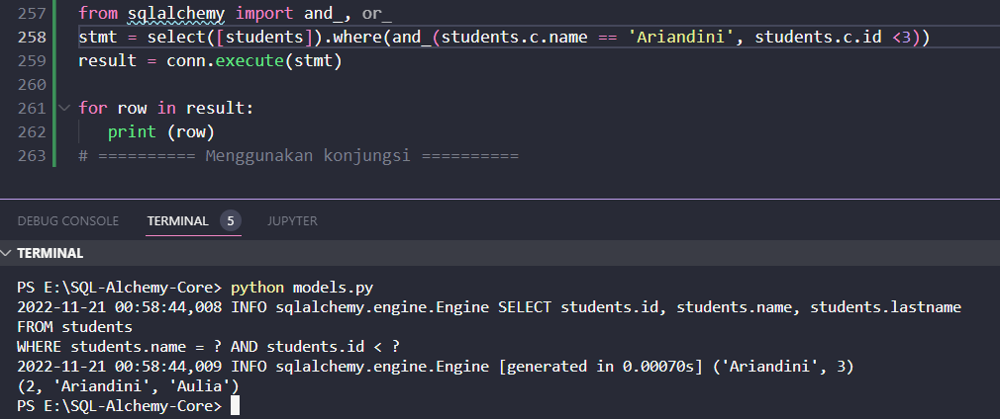
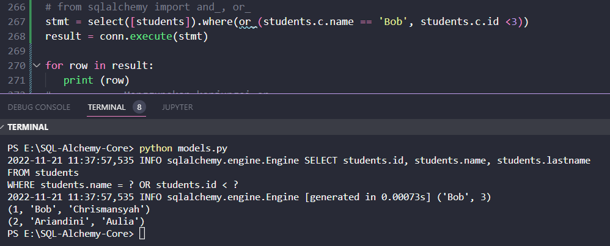
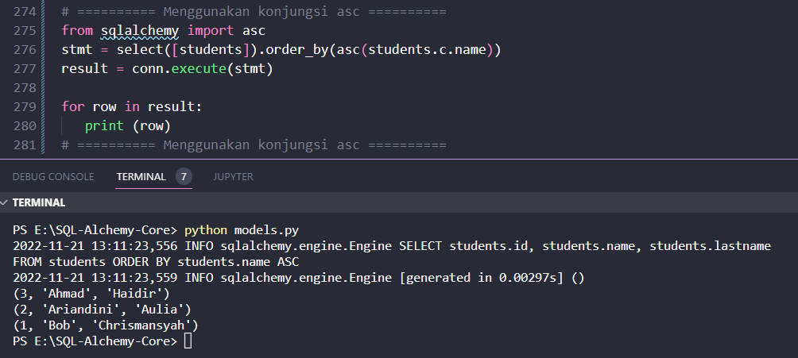
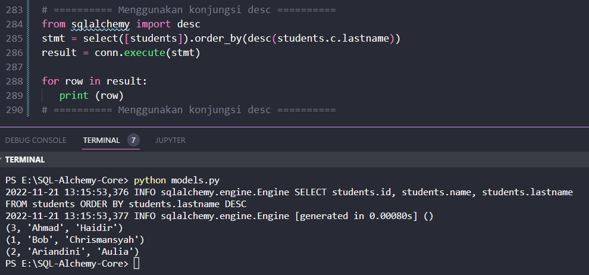
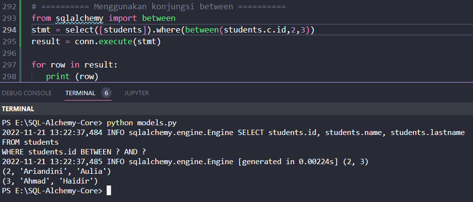

#### Menggunakan Konjungsi

Konjungsi adalah fungsi dalam modul SQLAlchemy yang mengimplementasikan operator relasional yang digunakan dalam klausa WHERE ekspresi SQL. Operator AND, OR, NOT, dll., digunakan untuk membentuk ekspresi majemuk yang menggabungkan dua ekspresi logis individual. Contoh sederhana penggunaan AND dalam pernyataan SELECT adalah sebagai berikut

```sql
SELECT * from EMPLOYEE WHERE salary>10000 AND age>30
```

Fungsi SQLAlchemy and_(), or_() dan not_() masing-masing mengimplementasikan operator AND, OR dan NOT.

##### and_() function

Ini menghasilkan konjungsi ekspresi yang digabungkan oleh AND. Contoh diberikan di bawah ini untuk pemahaman yang lebih baik

```python
from sqlalchemy import and_

print(
   and_(
      students.c.name == 'Ravi',
      students.c.id <3
   )
)
```

Ini diterjemahkan menjadi

```sql
students.name = :name_1 AND students.id < :id_1
```

Untuk menggunakan and_() dalam konstruksi select() pada tabel siswa, gunakan baris kode berikut

```python
stmt = select([students]).where(and_(students.c.name == 'Ravi', students.c.id <3))
```

Pernyataan SELECT dari sifat berikut akan dibangun

```sql
SELECT students.id, 
   students.name, 
   students.lastname
FROM students
WHERE students.name = :name_1 AND students.id < :id_1
```

Kode lengkap yang menampilkan keluaran dari kueri SELECT di atas adalah sebagai berikut

```python
from sqlalchemy import create_engine, MetaData, Table, Column, Integer, String, ForeignKey, select
engine = create_engine('sqlite:///college.db', echo = True)
meta = MetaData()
conn = engine.connect()

students = Table(
   'students', meta, 
   Column('id', Integer, primary_key = True), 
   Column('name', String), 
   Column('lastname', String), 
)

from sqlalchemy import and_, or_
stmt = select([students]).where(and_(students.c.name == 'Ariandini', students.c.id <3))
result = conn.execute(stmt)
print (result.fetchall())
```

output

```text
('Ariandini', 3)
(2, 'Ariandini', 'Aulia')
```



##### or_() function

Ini menghasilkan konjungsi ekspresi yang digabungkan dengan ATAU. Kami akan mengganti objek stmt dalam contoh di atas dengan yang berikut menggunakan or_()

```python
stmt = select([students]).where(or_(students.c.name == 'Ahmad', students.c.id <3))
```

Yang akan secara efektif setara dengan mengikuti kueri SELECT

```sql
SELECT students.id, 
   students.name, 
   students.lastname
FROM students
WHERE students.name = :name_1 
OR students.id < :id_1
```

Setelah Anda membuat substitusi dan menjalankan kode di atas, hasilnya adalah dua baris yang berada dalam kondisi OR

```text
(1, 'Bob', 'Chrismansyah')
(2, 'Ariandini', 'Aulia')
```



##### asc() function

Ini menghasilkan klausa ORDER BY naik. Fungsi mengambil kolom untuk menerapkan fungsi sebagai parameter.

```python
from sqlalchemy import asc
stmt = select([students]).order_by(asc(students.c.name))
```

Pernyataan tersebut mengimplementasikan ekspresi SQL berikut

```sql
SELECT students.id, 
   students.name, 
   students.lastname
FROM students 
ORDER BY students.name ASC
```

Kode berikut mencantumkan semua catatan dalam tabel siswa dalam urutan menaik kolom nama

```python
from sqlalchemy import asc
stmt = select([students]).order_by(asc(students.c.name))
result = conn.execute(stmt)

for row in result:
   print (row)
```

Kode di atas menghasilkan keluaran berikut 

```text
(3, 'Ahmad', 'Haidir')
(2, 'Ariandini', 'Aulia')
(1, 'Bob', 'Chrismansyah')
```



desc() function

Demikian pula fungsi desc() menghasilkan klausa ORDER BY menurun sebagai berikut

```python
from sqlalchemy import desc
stmt = select([students]).order_by(desc(students.c.lastname))
```

Ekspresi SQL yang setara adalah

```sql
SELECT students.id, 
   students.name, 
   students.lastname
FROM students
```

Dan output untuk baris kode di atas adalah

```text
(3, 'Ahmad', 'Haidir')
(1, 'Bob', 'Chrismansyah')
(2, 'Ariandini', 'Aulia')
```



##### between() function

Ini menghasilkan klausa predikat BETWEEN. Ini umumnya digunakan untuk memvalidasi jika nilai kolom tertentu berada di antara rentang. Misalnya, kode berikut memilih baris dengan kolom id antara 2 dan 4

```python
from sqlalchemy import between
stmt = select([students]).where(between(students.c.id,2,3))
print (stmt)
```

Ekspresi SQL adalah

```sql
SELECT students.id, 
   students.name, 
   students.lastname
FROM students
WHERE students.id 
BETWEEN :id_1 AND :id_3
```

dan hasilnya adalah sebagai berikut

```text
(2, 'Ariandini', 'Aulia')
(3, 'Ahmad', 'Haidir')
```


