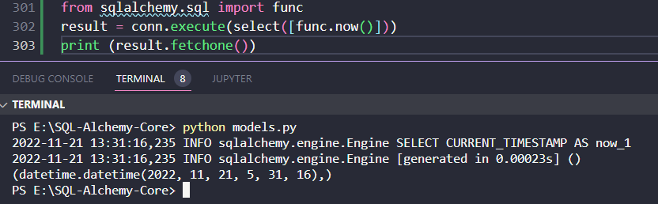

#### Menggunakan Fungsi

Beberapa fungsi penting yang digunakan dalam SQLAlchemy dibahas dalam bab ini.
SQL standar telah merekomendasikan banyak fungsi yang diimplementasikan oleh sebagian besar dialek. Mereka mengembalikan satu nilai berdasarkan argumen yang diteruskan ke sana. Beberapa fungsi SQL mengambil kolom sebagai argumen sedangkan beberapa bersifat umum. **Kata kunci thefunc di SQLAlchemy API digunakan untuk menghasilkan fungsi-fungsi ini**.
Dalam SQL, now() adalah fungsi generik. Pernyataan berikut merender fungsi now() menggunakan func

```python
from sqlalchemy.sql import func
result = conn.execute(select([func.now()]))
print (result.fetchone())
```

Contoh hasil kode di atas mungkin seperti yang ditunjukkan di bawah ini

```text
(datetime.datetime(2022, 11, 21, 5, 31, 16),)
```



Di sisi lain, fungsi count() yang mengembalikan jumlah baris yang dipilih dari sebuah tabel, dirender dengan mengikuti penggunaan func

```python
from sqlalchemy.sql import func
result = conn.execute(select([func.count(students.c.id)]))
print (result.fetchone())
```

Contoh hasil kode di atas mungkin seperti yang ditunjukkan di bawah ini

```text
(3,)
```

Dari kode di atas, akan diambil jumlah baris pada tabel students.

Beberapa fungsi SQL bawaan didemonstrasikan menggunakan tabel Karyawan dengan data berikut

| id | name | lastname |
| --- | --- | --- |
| 1 | Bob | Chrismansyah |
| 2 | Ariandini | Aulia |
| 3 | Ahmad | Haidir |

#### Fungsi max()

Fungsi max() diimplementasikan dengan mengikuti penggunaan func dari SQLAlchemy yang akan menghasilkan 85, total nilai maksimum yang diperoleh 

```python
from sqlalchemy.sql import func
result = conn.execute(select([func.max(students.c.id)]))
print (result.fetchone())
```

Outputnya

```text
(3,)
```

##### Fungsi min()

Demikian pula, fungsi min() yang akan mengembalikan 56, tanda minimum, akan dirender dengan mengikuti kode

```python
from sqlalchemy.sql import func
result = conn.execute(select([func.min(employee.c.marks)]))
print (result.fetchone())
```

Outputnya

```text
(1,)
```

##### fungsi AVG()

bisa diimplementasikan dengan menggunakan kode di bawah ini

```python
from sqlalchemy.sql import func
result = conn.execute(select([func.avg(employee.c.marks)]))
print (result.fetchone())
```

Otuputnya

```text
(2.0,)
```
