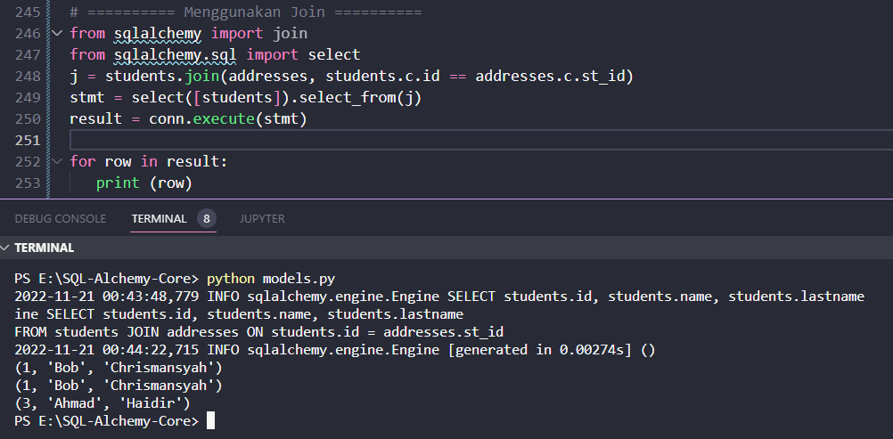

#### Menggunakan Joins

Dalam bab ini, kita akan mempelajari cara menggunakan Gabungan di SQLAlchemy.

Efek penggabungan dicapai dengan hanya menempatkan dua tabel di klausa kolom atau klausa where dari konstruksi select(). Sekarang kita menggunakan metode join() dan outerjoin().

Metode join() mengembalikan objek gabungan dari satu objek tabel ke objek lainnya.

```python
join(right, onclause = None, isouter = False, full = False)
```

Fungsi dari parameter yang disebutkan dalam kode di atas adalah sebagai berikut Fungsi dari parameter yang disebutkan dalam kode di atas adalah sebagai berikut 

- **right** − sisi kanan sambungan; ini adalah objek Tabel apa pun
- **onclause** − ekspresi SQL yang mewakili klausa ON dari gabungan. Jika dibiarkan di Tidak ada, ia mencoba menggabungkan dua tabel berdasarkan hubungan kunci asing
- **isouter** − jika True, membuat LEFT OUTER JOIN, bukan JOIN
- **full** - jika True, membuat FULL OUTER JOIN, bukan LEFT OUTER JOIN

Misalnya, penggunaan metode join() berikut akan secara otomatis menghasilkan join berdasarkan kunci asing.

```python
>>> print(students.join(addresses))
```

Ini setara dengan mengikuti ekspresi SQL

```sql
students JOIN addresses ON students.id = addresses.st_id
```

Anda dapat secara eksplisit menyebutkan kriteria bergabung sebagai berikut

```python
j = students.join(addresses, students.c.id == addresses.c.st_id)
```

Jika kita sekarang membuat konstruk pilih di bawah menggunakan gabungan ini sebagai

```python
stmt = select([students]).select_from(j)
```

Ini akan menghasilkan ekspresi SQL berikut

```sql
SELECT students.id, students.name, students.lastname
FROM students JOIN addresses ON students.id = addresses.st_id
```

Jika pernyataan ini dijalankan menggunakan koneksi yang mewakili mesin, data milik kolom yang dipilih akan ditampilkan. Kode lengkapnya adalah sebagai berikut

```python
Jika pernyataan ini dijalankan menggunakan koneksi yang mewakili mesin, data milik kolom yang dipilih akan ditampilkan. Kode lengkapnya adalah sebagai berikut

from sqlalchemy import create_engine, MetaData, Table, Column, Integer, String, ForeignKey
engine = create_engine('sqlite:///college.db', echo = True)

meta = MetaData()
conn = engine.connect()
students = Table(
   'students', meta, 
   Column('id', Integer, primary_key = True), 
   Column('name', String), 
   Column('lastname', String), 
)

addresses = Table(
   'addresses', meta, 
   Column('id', Integer, primary_key = True), 
   Column('st_id', Integer,ForeignKey('students.id')), 
   Column('postal_add', String), 
   Column('email_add', String)
)

from sqlalchemy import join
from sqlalchemy.sql import select
j = students.join(addresses, students.c.id == addresses.c.st_id)
stmt = select([students]).select_from(j)
result = conn.execute(stmt)

for row in result:
   print (row)
```

output

```text
(1, 'Bob', 'Chrismansyah')
(1, 'Bob', 'Chrismansyah')
(3, 'Ahmad', 'Haidir')
```

