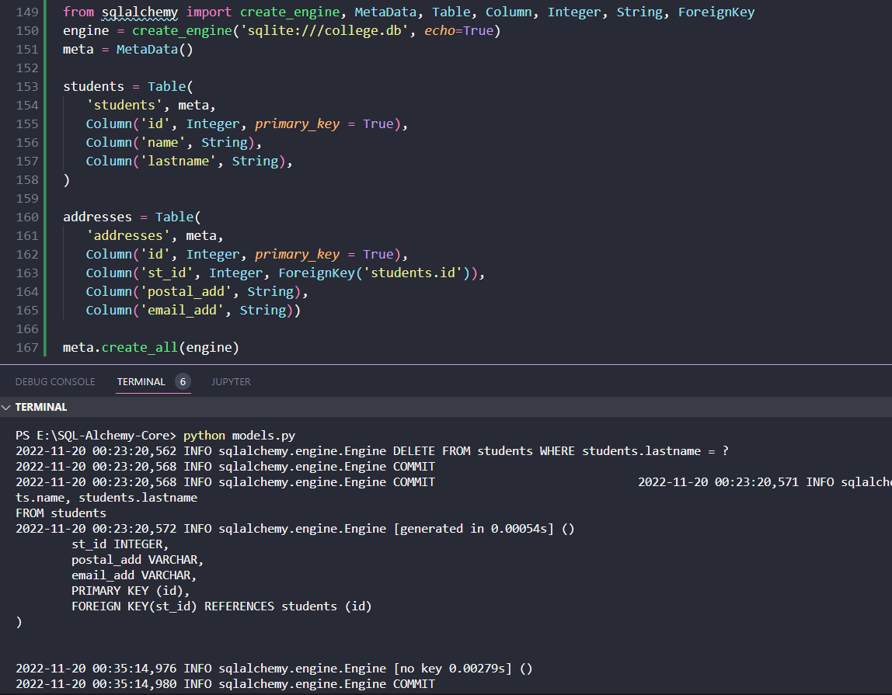
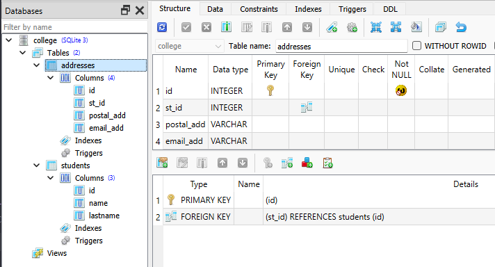
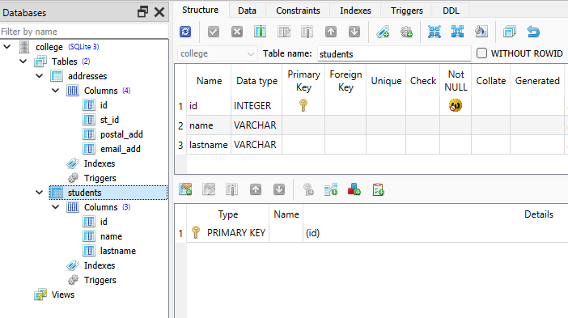
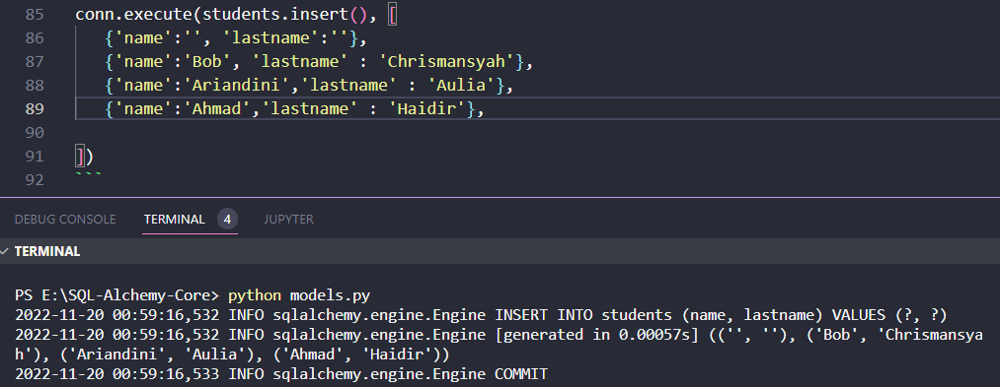
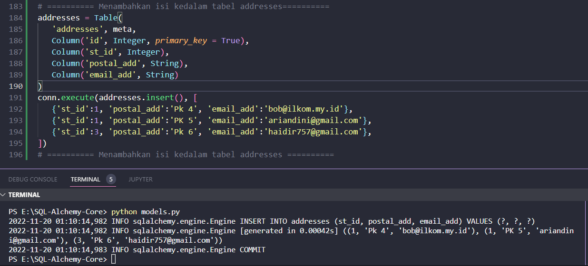
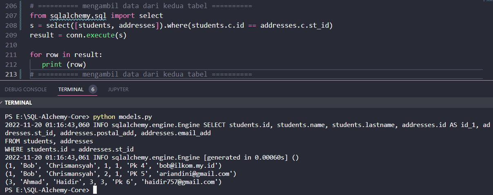

#### Menggunakan Banyak Tabel

Salah satu fitur penting RDBMS adalah membangun hubungan antar tabel. Operasi SQL seperti SELECT, UPDATE dan DELETE dapat dilakukan pada tabel terkait. Bagian ini menjelaskan operasi ini menggunakan SQLAlchemy.

Untuk tujuan ini, dua tabel dibuat di database SQLite kami (college.db). Tabel siswa memiliki struktur yang sama seperti yang diberikan pada bagian sebelumnya; sedangkan tabel alamat memiliki kolom st_id yang dipetakan ke kolom id pada tabel siswa menggunakan batasan kunci asing.

Kode berikut akan membuat dua tabel di college.db

```python
from sqlalchemy import create_engine, MetaData, Table, Column, Integer, String, ForeignKey
engine = create_engine('sqlite:///college.db', echo=True)
meta = MetaData()

students = Table(
   'students', meta, 
   Column('id', Integer, primary_key = True), 
   Column('name', String), 
   Column('lastname', String), 
)

addresses = Table(
   'addresses', meta, 
   Column('id', Integer, primary_key = True), 
   Column('st_id', Integer, ForeignKey('students.id')), 
   Column('postal_add', String), 
   Column('email_add', String))

meta.create_all(engine)
```

Output:

```text
INFO sqlalchemy.engine.Engine SELECT students.id, students.name, students.lastname FROM students
2022-11-20 00:23:20,572 INFO sqlalchemy.engine.Engine [generated in 0.00054s] ()
        st_id INTEGER,
        postal_add VARCHAR,
        email_add VARCHAR,
        PRIMARY KEY (id),
        FOREIGN KEY(st_id) REFERENCES students (id)
)
```



Kode di atas akan diterjemahkan menjadi kueri CREATE TABLE untuk siswa dan tabel alamat seperti di bawah ini

```sql
CREATE TABLE students (
   id INTEGER NOT NULL,
   name VARCHAR,
   lastname VARCHAR,
   PRIMARY KEY (id)
)

CREATE TABLE addresses (
   id INTEGER NOT NULL,
   st_id INTEGER,
   postal_add VARCHAR,
   email_add VARCHAR,
   PRIMARY KEY (id),
   FOREIGN KEY(st_id) REFERENCES students (id)
)
```





Tabel ini diisi dengan data dengan mengeksekusi metode insert() dari objek tabel. Untuk menyisipkan 4 baris pada tabel siswa, Anda dapat menggunakan kode di bawah ini

```python
conn.execute(students.insert(), [
   {'name':'', 'lastname':''},
   {'name':'Bob', 'lastname' : 'Chrismansyah'},
   {'name':'Ariandini','lastname' : 'Aulia'},
   {'name':'Ahmad','lastname' : 'Haidir'},
    
])
```



Baris ditambahkan dalam tabel alamat dengan bantuan kode berikut

```python
addresses = Table(
   'addresses', meta, 
   Column('id', Integer, primary_key = True), 
   Column('st_id', Integer), 
   Column('postal_add', String), 
   Column('email_add', String)
)
conn.execute(addresses.insert(), [
   {'st_id':1, 'postal_add':'Pk 4', 'email_add':'bob@ilkom.my.id'},
   {'st_id':1, 'postal_add':'PK 5', 'email_add':'ariandini@gmail.com'},
   {'st_id':3, 'postal_add':'Pk 6', 'email_add':'haidir757@gmail.com'},
])
```
Output:

```text
2022-11-20 01:10:14,982 INFO sqlalchemy.engine.Engine INSERT INTO addresses (st_id, postal_add, email_add) VALUES (?, ?, ?)
2022-11-20 01:10:14,982 INFO sqlalchemy.engine.Engine [generated in 0.00042s] ((1, 'Pk 4', 'bob@ilkom.my.id'), (1, 'PK 5', 'ariandini@gmail.com'), (3, 'Pk 6', 'haidir757@gmail.com'))
2022-11-20 01:10:14,983 INFO sqlalchemy.engine.Engine COMMIT
```



Perhatikan bahwa kolom st_id di tabel alamat merujuk ke kolom id di tabel siswa. Kita sekarang dapat menggunakan relasi ini untuk mengambil data dari kedua tabel. Kami ingin mengambil nama dan nama belakang dari tabel siswa yang sesuai dengan st_id di tabel alamat.

```python
from sqlalchemy.sql import select
s = select([students, addresses]).where(students.c.id == addresses.c.st_id)
result = conn.execute(s)

for row in result:
   print (row)
```

Output:

```text
(1, 'Bob', 'Chrismansyah', 1, 1, 'Pk 4', 'bob@ilkom.my.id')
(1, 'Bob', 'Chrismansyah', 2, 1, 'PK 5', 'ariandini@gmail.com')
(3, 'Ahmad', 'Haidir', 3, 3, 'Pk 6', 'haidir757@gmail.com')
```



Objek yang dipilih akan secara efektif diterjemahkan ke dalam ekspresi SQL berikut yang menggabungkan dua tabel pada relasi umum

```sql
SELECT students.id, 
   students.name, 
   students.lastname, 
   addresses.id, 
   addresses.st_id, 
   addresses.postal_add, 
   addresses.email_add
FROM students, addresses
WHERE students.id = addresses.st_id
```

