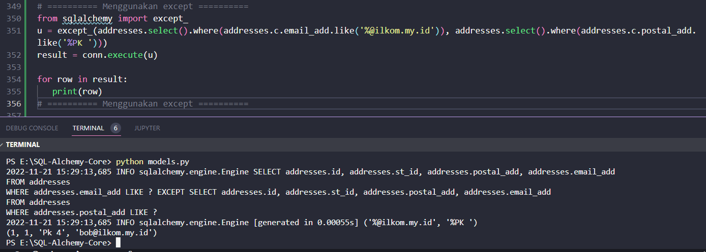
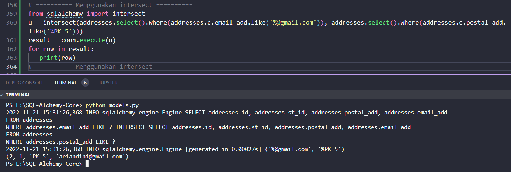

#### Menggunakan Operasi Set

Set operasi seperti UNION dan INTERSECT didukung oleh SQL standar dan sebagian besar dialeknya. SQLAlchemy mengimplementasikannya dengan bantuan fungsi berikut

##### union()

Saat menggabungkan hasil dari dua atau lebih pernyataan SELECT, UNION menghapus duplikat dari kumpulan hasil. Jumlah kolom dan tipe data harus sama di kedua tabel.

Fungsi union() mengembalikan objek CompoundSelect dari beberapa tabel. Contoh berikut menunjukkan penggunaannya

```python
from sqlalchemy import union
u = union(addresses.select().where(addresses.c.email_add.like('%gmail%')), addresses.select().where(addresses.c.email_add.like('%yahoo%')))
result = conn.execute(u)
for row in result:
   print (row)
```

Konstruk gabungan diterjemahkan menjadi ekspresi SQL berikut

```sql
SELECT addresses.id, 
   addresses.st_id, 
   addresses.postal_add, 
   addresses.email_add
FROM addresses
WHERE addresses.email_add LIKE ? UNION SELECT addresses.id, 
   addresses.st_id, 
   addresses.postal_add, 
   addresses.email_add
FROM addresses
WHERE addresses.email_add LIKE ?
```

Outputnya 

```text
(2, 1, 'PK 5', 'ariandini@gmail.com')
(3, 3, 'Pk 6', 'haidir757@gmail.com')
```

")

##### union_all()

Operasi UNION ALL tidak dapat menghapus duplikat dan tidak dapat mengurutkan data dalam kumpulan hasil. Misalnya, dalam kueri di atas, UNION diganti dengan UNION ALL untuk melihat efeknya.

```python
u = union_all(addresses.select().where(addresses.c.email_add.like('%@gmail.com')), addresses.select().where(addresses.c.email_add.like('%@yahoo.com')))
result = conn.execute(u)
for row in result:
   print (row)
```

Jika dirun hasilnya

")

Ekspresi SQL yang sesuai adalah sebagai berikut

```sql
SELECT addresses.id, 
   addresses.st_id, 
   addresses.postal_add, 
   addresses.email_add
FROM addresses
WHERE addresses.email_add LIKE ? UNION ALL SELECT addresses.id, 
   addresses.st_id, 
   addresses.postal_add, 
   addresses.email_add
FROM addresses
WHERE addresses.email_add LIKE ?
```

##### excewpt()

Klausa/operator SQL EXCEPT digunakan untuk menggabungkan dua pernyataan SELECT dan mengembalikan baris dari pernyataan SELECT pertama yang tidak dikembalikan oleh pernyataan SELECT kedua. Fungsi exception_() menghasilkan ekspresi SELECT dengan klausa EXCEPT.

Dalam contoh berikut, fungsi exception_() hanya mengembalikan rekaman dari tabel alamat yang memiliki 'gmail.com' di bidang email_add tetapi mengecualikan yang memiliki 'Pune' sebagai bagian dari bidang postal_add.

```python
from sqlalchemy import except_
u = except_(addresses.select().where(addresses.c.email_add.like('%@ilkom.my.id')), addresses.select().where(addresses.c.postal_add.like('%PK ')))
result = conn.execute(u)

for row in result:
   print(row)
```



Hasil dari kode di atas adalah ekspresi SQL berikut

```sql
SELECT addresses.id, 
   addresses.st_id, 
   addresses.postal_add, 
   addresses.email_add
FROM addresses
WHERE addresses.email_add LIKE ? EXCEPT SELECT addresses.id, 
   addresses.st_id, 
   addresses.postal_add, 
   addresses.email_add
FROM addresses
WHERE addresses.postal_add LIKE ?
```

##### intersect()

Menggunakan operator INTERSECT, SQL menampilkan baris umum dari kedua pernyataan SELECT. Fungsi intersect() mengimplementasikan perilaku ini.

Dalam contoh berikut, dua konstruksi SELECT adalah parameter untuk fungsi intersect(). Satu mengembalikan baris yang berisi 'gmail.com' sebagai bagian dari kolom email_add, dan yang lainnya mengembalikan baris yang memiliki 'Pune' sebagai bagian dari kolom postal_add. Hasilnya akan menjadi baris umum dari kedua set hasil.

```python
u = intersect(addresses.select().where(addresses.c.email_add.like('%@gmail.com')), addresses.select().where(addresses.c.postal_add.like('%Pune')))
result = conn.execute(u)
for row in result:
   print(row)
```

Jika dirun hasilnya



Dalam SQL sebagai berikut

```sql
SELECT addresses.id, 
   addresses.st_id, 
   addresses.postal_add, 
   addresses.email_add
FROM addresses
WHERE addresses.email_add LIKE ? INTERSECT SELECT addresses.id, 
   addresses.st_id, 
   addresses.postal_add, 
   addresses.email_add
FROM addresses
WHERE addresses.postal_add LIKE ?
```
Dua parameter terikat '%gmail.com' dan '%PK 5' menghasilkan satu baris dari data asli di tabel alamat seperti yang ditunjukkan di bawah ini

```text
2022-11-21 15:31:26,368 INFO sqlalchemy.engine.Engine [generated in 0.00027s] ('%@gmail.com', '%PK 5')
(2, 1, 'PK 5', 'ariandini@gmail.com')
```
