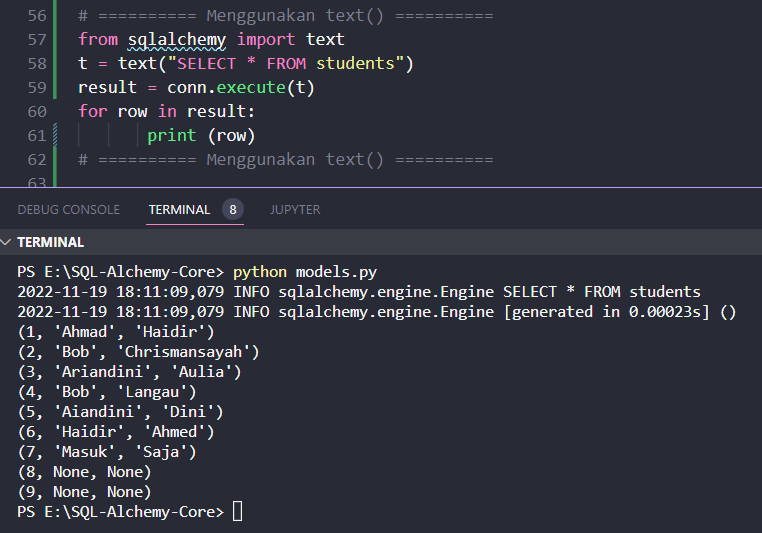
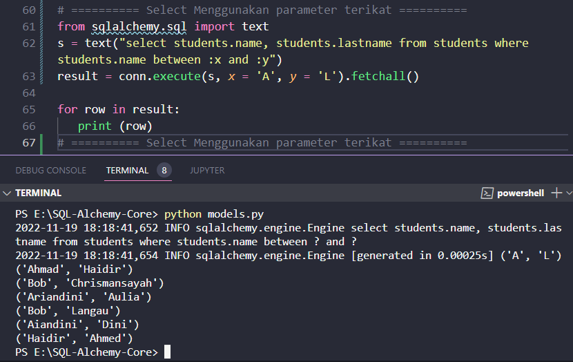

### SQL Textual

SQLAlchemy memungkinkan Anda hanya menggunakan string, untuk kasus-kasus ketika SQL sudah dikenal dan tidak ada kebutuhan yang kuat untuk pernyataan untuk mendukung fitur dinamis. Konstruksi text() digunakan untuk menyusun pernyataan tekstual yang diteruskan ke database yang sebagian besar tidak berubah.

Itu membangun TextClause baru , yang mewakili string SQL tekstual secara langsung seperti yang ditunjukkan pada kode di bawah ini

```python
from sqlalchemy import text
t = text("SELECT * FROM students")
result = connection.execute(t)
```



Keuntungan yang disediankan **text()** adalah:

- dukungan backend-netral untuk mengikat parameter
- opsi eksekusi per-pernyataan
- perilaku mengetik hasil-kolom

#### Menggunakan parameter terikat

Fungsi text() membutuhkan parameter Bound dalam format titik dua bernama. Mereka konsisten terlepas dari backend database. Untuk mengirim nilai untuk parameter, kami meneruskannya ke metode execution() sebagai argumen tambahan.

Contoh berikut menggunakan parameter terikat dalam SQL tekstual

```python
from sqlalchemy.sql import text
s = text("select students.name, students.lastname from students where students.name between :x and :y")
conn.execute(s, x = 'A', y = 'L').fetchall()
```
Jika dijalankan, hasilnya sebagai berikut



Fungsi text() membuat ekspresi SQL sebagai berikut:

```python
select students.name, students.lastname from students where students.name between ? and ?
```

Nilai x = 'A' dan y = 'L' dilewatkan sebagai parameter. Hasilnya adalah daftar baris dengan nama antara 'A' dan 'L' 

```python
('Ahmad', 'Haidir')('Bob', 'Chrismansayah')('Ariandini', 'Aulia')
```

Konstruksi text() mendukung nilai terikat yang telah ditetapkan sebelumnya menggunakan metode TextClause.bindparams() . Parameter juga dapat diketik secara eksplisit sebagai berikut

```python

stmt = text("SELECT * FROM students WHERE students.name BETWEEN :x AND :y")

stmt = stmt.bindparams(
   bindparam("x", type_= String), 
   bindparam("y", type_= String)
)

result = conn.execute(stmt, {"x": "A", "y": "L"})

# The text() function also be produces fragments of SQL within a select() object that 
# accepts text() objects as an arguments. The “geometry” of the statement is provided by 
# select() construct , and the textual content by text() construct. We can build a statement 
# without the need to refer to any pre-established Table metadata. 

from sqlalchemy.sql import select
s = select([text("students.name, students.lastname from students")]).where(text("students.name between :x and :y"))
conn.execute(s, x = 'A', y = 'L').fetchall()
```

Anda juga dapat menggunakan fungsi and_() untuk menggabungkan beberapa kondisi dalam klausa WHERE yang dibuat dengan bantuan 
fungsi text().

```python
from sqlalchemy import and_
from sqlalchemy.sql import select
s = select([text("* from students")]) \
.where(
   and_(
      text("students.name between :x and :y"),
      text("students.id>2")
   )
)
conn.execute(s, x = 'A', y = 'L').fetchall()
```

Kode di atas mengambil baris dengan nama antara "A" dan "L" dengan id lebih besar dari 2. Keluaran kode diberikan di bawah ini -