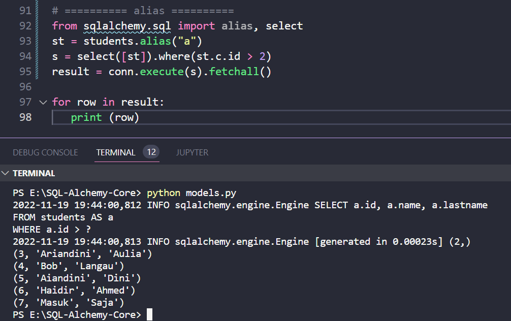

#### Menggunakan Alias

Alias ​​​​dalam SQL sesuai dengan versi "berganti nama" dari tabel atau pernyataan SELECT, yang terjadi kapan saja Anda mengatakan "SELECT * FROM table1 AS a". AS membuat nama baru untuk tabel. Alias ​​​​memungkinkan setiap tabel atau subkueri direferensikan dengan nama unik.

Dalam kasus tabel, ini memungkinkan tabel yang sama diberi nama dalam klausa FROM berkali-kali. Ini memberikan nama induk untuk kolom yang diwakili oleh pernyataan, yang memungkinkan mereka untuk direferensikan relatif terhadap nama ini.

Dalam SQLAlchemy, setiap Tabel, konstruk select(), atau objek lain yang dapat dipilih dapat diubah menjadi alias menggunakan metode From Clause.alias(), yang menghasilkan konstruksi Alias. Fungsi alias() dalam modul sqlalchemy.sql mewakili sebuah alias, seperti yang biasanya diterapkan pada tabel atau sub-pilihan apa pun dalam pernyataan SQL menggunakan kata kunci AS.

```python
from sqlalchemy.sql import alias
st = student.alias("a")
```

Alias ​​​​ini sekarang dapat digunakan dalam konstruk select() untuk merujuk ke tabel siswa

```python
s = select([st]).where(st.c.id>2)
```

Ini diterjemahkan menjadi ekspresi SQL sebagai berikut

```python
SELECT a.id, a.name, a.lastname FROM students AS a WHERE a.id > 2
```

Kita sekarang dapat mengeksekusi kueri SQL ini dengan metode execution() dari objek koneksi. Kode lengkapnya adalah sebagai berikut 

```python
from sqlalchemy.sql import alias, select
st = students.alias("a")
s = select([st]).where(st.c.id > 2)
conn.execute(s).fetchall()
```


Ketika baris kode di atas dijalankan, itu menghasilkan keluaran berikut

```text
(2,)
(3, 'Ariandini', 'Aulia')
(4, 'Bob', 'Langau')
(5, 'Aiandini', 'Dini')
(6, 'Haidir', 'Ahmed')
(7, 'Masuk', 'Saja')
```